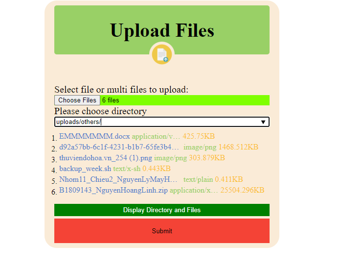
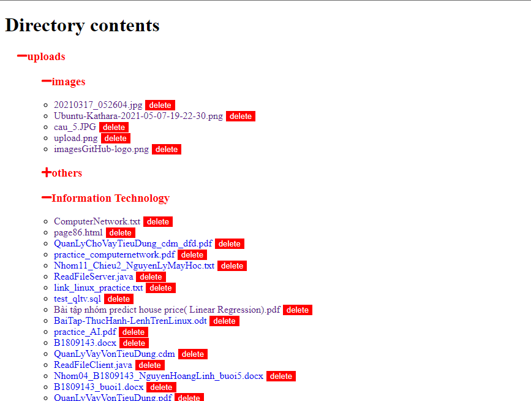

# **Manage Remote Files**  

## Features
- upload multiple files 
- list tree directory of files
- download files
- delete file
## Manual
1. Goto url [hoanglinhplus-upload](https://www.hoanglinhplus.cf/upload/)
2. choose one or multiple files to upload
3. place folder
  
4. display file with tree directory
   
   
